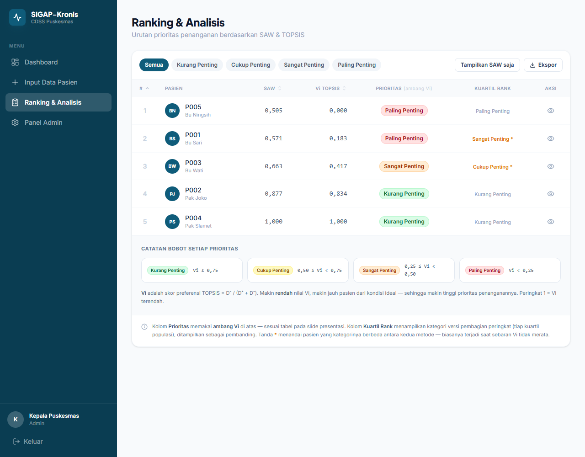

# SIGAP-Kronis

> Sistem Pendukung Keputusan untuk Stratifikasi Risiko Pasien Hipertensi & Diabetes Melitus Tipe 2 — alat bantu deteksi dini dan prioritas intervensi di tingkat Puskesmas.


Tugas besar mata kuliah **Sistem Cerdas dan Pendukung Keputusan** — Informatika/E, Universitas Islam Indonesia.

---

## Latar Belakang

Hipertensi dan diabetes adalah akar dari penyakit katastropik lain: **44%** penyakit jantung dipicu hipertensi tak terkontrol, prevalensi hipertensi nasional **30%**, dan **60%** lansia Indonesia mengalaminya. Biaya penyakit jantung menembus **Rp19 triliun/tahun** (2024–2025).

Masalah nyatanya bukan ketiadaan data, melainkan ***loss of follow-up***: kader rutin mengukur tensi dan gula darah, datanya tercatat di buku, tapi tidak pernah diolah menjadi stratifikasi risiko — sehingga tidak jelas pasien mana yang harus ditangani lebih dulu.

SIGAP-Kronis menutup celah itu dengan mengubah data pemeriksaan rutin menjadi **peringkat prioritas yang terukur**, sebelum komplikasi terjadi.

> Latar belakang bersumber dari kuliah pakar dr. Riana Rahmawati, Dokter Umum FK UII.

---

## Tampilan



---

## Metode

Tiga metode MADM dipakai berurutan — masing-masing menjawab pertanyaan berbeda:

| Metode | Perannya |
|---|---|
| **AHP** | Menentukan **bobot** tiap kriteria dari perbandingan berpasangan penilaian dokter, lalu diuji konsistensinya lewat CR. |
| **SAW** | Menjumlahkan nilai ternormalisasi × bobot — sederhana, cepat, mudah diaudit tenaga medis. |
| **TOPSIS** | Mengukur jarak tiap pasien ke solusi ideal positif & negatif — memisahkan pasien aman dari red flag dengan lebih tegas. |

SAW dan TOPSIS dijalankan **berdampingan sebagai validasi silang**: bila keduanya sepakat, keputusan lebih tepercaya.

### Kriteria

| Kode | Kriteria | Satuan | Sifat |
|---|---|---|---|
| C1 | Tekanan Darah Sistolik | mmHg | Cost |
| C2 | Gula Darah Puasa | mg/dL | Cost |
| C3 | Usia | tahun | Cost |
| C4 | IMT / BMI | kg/m² | Cost |
| C5 | Kepatuhan Kontrol/Obat | skala 1–5 | Benefit |

*Cost* — makin rendah makin aman. *Benefit* — makin tinggi makin baik.

### AHP autentik

Bobot **diturunkan dari** matriks perbandingan berpasangan lewat rata-rata geometrik — bukan ditetapkan lebih dulu lalu dibuatkan matriksnya. Konsekuensinya, uji konsistensi di sini benar-benar bermakna (CR bersifat non-trivial, bukan otomatis nol).

Matriks penilaian expert (skala Saaty):

|    | C1 | C2 | C3 | C4 | C5 |
|----|----|----|----|----|----|
| **C1** | 1 | 1 | 5 | 5 | 3 |
| **C2** | 1 | 1 | 5 | 5 | 3 |
| **C3** | 1/5 | 1/5 | 1 | 1 | 1/3 |
| **C4** | 1/5 | 1/5 | 1 | 1 | 1/3 |
| **C5** | 1/3 | 1/3 | 3 | 3 | 1 |

Bobot hasil: **C1 = C2 = 0,360** · **C5 = 0,152** · **C3 = C4 = 0,064** (jumlah = 1,000)

Uji konsistensi: **λmax = 5,056** · **CI = 0,014** · **CR = 0,012 ≤ 0,1 → KONSISTEN**

Matriks ini **editable** lewat Panel Admin — bobot, λmax, CI, dan CR langsung dihitung ulang, dan seluruh skor pasien ikut ter-update.

### Kategori prioritas (ambang Vi TOPSIS)

| Kategori | Ambang |
|---|---|
| 🟢 Kurang Penting | Vi ≥ 0,75 |
| 🟡 Cukup Penting | 0,50 ≤ Vi < 0,75 |
| 🟠 Sangat Penting | 0,25 ≤ Vi < 0,50 |
| 🔴 Paling Penting | Vi < 0,25 |

---

## Hasil Studi Kasus

Lima pasien uji coba, dihitung dengan bobot AHP di atas:

| Pasien | C1 | C2 | C3 | C4 | C5 | SAW | Vi TOPSIS | Kategori |
|---|----|----|----|----|----|-----|-----------|----------|
| Pak Slamet | 120 | 95 | 38 | 21 | 5 | 1,000 | 1,000 | 🟢 Kurang Penting |
| Pak Joko | 130 | 110 | 45 | 23 | 4 | 0,877 | 0,834 | 🟢 Kurang Penting |
| Bu Wati | 150 | 180 | 55 | 27 | 3 | 0,663 | 0,417 | 🟠 Sangat Penting |
| Bu Sari | 165 | 210 | 62 | 29 | 2 | 0,571 | 0,183 | 🔴 Paling Penting |
| Bu Ningsih | 175 | 230 | 68 | 31 | 1 | 0,505 | 0,000 | 🔴 Paling Penting |

Kedua metode menghasilkan **urutan identik** (Slamet > Joko > Wati > Sari > Ningsih). TOPSIS memberi gap lebih tajam, sehingga lebih tegas memisahkan pasien aman dari red flag.

---

## Fitur

### Akses berbasis peran

| Peran | Kewenangan |
|---|---|
| **Kader / Posyandu-ILP** | Input data pemeriksaan rutin · lihat ranking (read-only, nama pasien disamarkan jadi inisial) · lihat riwayat tindak lanjut |
| **Dokter / Perawat** | Validasi skor risiko · tambah catatan tindak lanjut · tandai "sudah ditindaklanjuti" |
| **Kepala Puskesmas / Admin** | Seluruh privilege — kelola kriteria & matriks AHP · kelola pengguna · CRUD data pasien |

Pembatasan peran ditegakkan **di sisi server**, bukan sekadar menyembunyikan menu.

### Fitur pendukung

- Matriks pairwise editable → bobot, λmax, CI & CR terhitung otomatis
- **Tambah/hapus kriteria** — SAW & TOPSIS ikut menyesuaikan, tidak di-hardcode C1–C5
- Notifikasi red flag di dashboard
- Radar chart pasien vs rata-rata populasi
- Riwayat tindak lanjut per pasien + indikator tren skor
- Toggle tampilan SAW saja vs SAW + TOPSIS
- Kolom pembanding **Kuartil Rank** di samping kategori ambang Vi
- Auto-increment ID pasien (P0xx)
- Validasi input berlapis (sistolik 60–250, GDP 50–600, usia 1–120, BMI 10–60, kepatuhan 1–5)
- Halaman **daftar akun**, **lupa password**, dan **reset password** dengan token
- Responsif sampai layar 390px

### Keamanan

- Password di-hash **bcrypt**
- Sesi memakai cookie **httpOnly** — token tidak pernah menyentuh JavaScript
- Token reset disimpan **ter-hash SHA-256**, sekali pakai, dan ada masa berlaku
- Endpoint lupa-password tidak membocorkan email mana yang terdaftar
- Seluruh query lewat **prepared statement**

---

## Teknologi

**Frontend** — React 19 · TypeScript · Vite 8 · Tailwind CSS 4 · React Router · Recharts · Lucide

**Backend** — PHP 8.2 (tanpa framework) · REST API · PDO

**Basis data** — MySQL / MariaDB (7 tabel ternormalisasi)

```
src/
├── core/          # ahp.ts · madm.ts  ← mesin perhitungan (AHP, SAW, TOPSIS)
│   └── __tests__/ # tes yang mengunci hasil ke angka di slide presentasi
├── context/       # Auth · Data · Toast
├── pages/         # landing · auth · app (dashboard, ranking, detail, admin)
└── components/    # layout & UI primitives

api/
├── index.php      # front controller
├── lib/           # Auth · Database · Request · Response
└── routes/        # auth · patients · criteria · users

database/schema.sql   # skema + data awal (5 pasien, 4 akun demo)
docker/               # konfigurasi Apache & .htaccess versi container
```

---

## Menjalankan

### Opsi A — XAMPP

1. Taruh proyek di `C:\xampp\htdocs\SIGAP-Kronis`
2. Nyalakan **Apache** dan **MySQL**
3. Impor skema:
   ```bash
   C:\xampp\mysql\bin\mysql.exe -u root < database\schema.sql
   ```
   > ⚠️ Skrip diawali `DROP DATABASE IF EXISTS sigap_kronis` — data lama akan terhapus.
4. Build:
   ```bash
   npm install
   npm run build
   ```
5. Buka <http://localhost/SIGAP-Kronis/dist/>

### Opsi B — Docker

Aplikasi berjalan sebagai satu container (Apache + PHP + hasil build), memakai MySQL yang sudah ada di network eksternal.

```bash
cp .env.example .env      # isi kredensial MySQL Anda
docker compose up -d --build
```

Buka <http://localhost:8021>

Sesuaikan `SIGAP_DB_HOST` di `docker-compose.yml` dengan nama container MySQL Anda, dan pastikan skema `sigap_kronis` sudah diimpor ke instance MySQL tersebut.

### Mode pengembangan

```bash
npm run dev     # http://localhost:8443 — hot reload
```

Apache tetap perlu menyala: Vite mem-proxy `/api` ke Apache agar cookie sesi tetap same-origin.

### Akun demo

| Peran | Username | Password |
|---|---|---|
| Admin | `admin.puskesmas` | `admin123` |
| Dokter/Perawat | `dr.ahmad` | `dokter123` |
| Kader | `kader.siti` | `kader123` |

---

## Pengujian

```bash
node --test src/core/__tests__/calc.test.mts
```

18 tes mengunci mesin perhitungan ke angka yang dipublikasikan di slide — λmax, CI, CR, urutan ranking, batas kategori, sampai kasus tepi (pasien < 2, kriteria tambahan). Kalau ada yang tak sengaja mengubah rumus AHP/SAW/TOPSIS, tes ini gagal.

---

## Keterbatasan & Pengembangan Lanjut

Ditemukan saat pengujian: **skor pasien lama berubah ketika pasien baru ditambahkan**, padahal data klinisnya sendiri tidak berubah (mis. Vi Pak Slamet 1,000 → 0,917 setelah satu pasien baru masuk).

Ini **bukan bug**, melainkan konsekuensi model: SAW & TOPSIS menormalisasi nilai secara **relatif** terhadap min/max seluruh pasien saat itu — berbeda dari skor absolut berbasis ambang medis tetap.

Arah pengembangan:

1. Kombinasikan skor relatif dengan **ambang absolut medis** — JNC8 untuk hipertensi, ADA untuk diabetes — sebagai validasi tambahan.
2. Tampilkan status pasien terhadap ambang absolut **terpisah** dari ranking relatif, agar penurunan peringkat tidak disalahartikan sebagai perburukan kondisi klinis.

---

## Tim

**Kelompok "Kesatria Naga Hitam"** — Informatika/E, Universitas Islam Indonesia

- Aurel Aldo Givary Prasetyo
- W. Andika Aditama
- Rifqi Aunnur Rohman
- Muhammad Akbar Pratama

---

<div align="center">
<sub>SIGAP-Kronis — mengubah data pemeriksaan rutin menjadi prioritas intervensi yang terukur, sebelum komplikasi terjadi.</sub>
</div>
